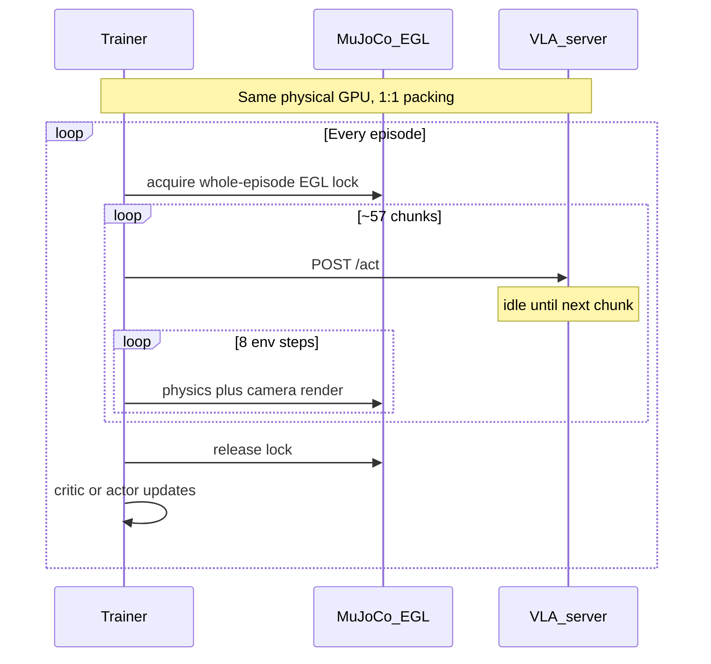

# GPU utilization bottleneck

Status: diagnosed from V15 metrics + live `/act` probes; Rank-1 mitigation is VLA chunk prefetch (`RLT_VLA_PREFETCH`).

## Why raising updates / parallel eval did not help

V15 `residual_rlt_actor` (~370 eps): **~97.5s/episode** wall, **`update_elapsed_sec` ~0.9s (~1%)**, `steps_per_sec` ~4.7. Baseline without RLT updates is only ~90.9s.

Live `/act` median ~**350ms**. ~57 chunks/episode → ~20s serial VLA (~21%). Residual ~**73%** is MuJoCo CPU physics + EGL render. Local RLT actor ~5–6%.

Raising updates 8→128 (~0.11s/round) only grows the update slice to ~**13%** of wall → ~**+9 pp** average util if rollout util stays ~25%. Parallel eval cells raise **machine throughput**, not per-rollout SM occupancy.

## Root cause

One trainer + one VLA server on the **same GPU**, `num_workers=1`, whole-episode EGL lock, then post-episode train. VLA is called once per **chunk_size=8** policy steps; between calls the server holds ~13GB at 0% util while MuJoCo runs (~33 `mj_step`s + EGL cameras per policy step). `serve.py` global lock is irrelevant with a single client.

Code anchors: `train_rlt_online.py` (`_egl_gpu_lock` + `run_evaluation` then `_train_after_episode`), `CHUNK_SIZE=8`, `serve.py` `threading.Lock`, `launch_v16_controlled.sh` shared `CUDA_VISIBLE_DEVICES`.

## Elimination roadmap (ranked)

| Rank | Change | Expected util gain | Risk |
| ---: | --- | --- | --- |
| 1 | Prefetch next `/act` during late steps of current chunk | High on VLA GPU | Medium |
| 2 | Interleave critic/actor micro-updates during MuJoCo gaps | High on trainer GPU | Medium–high |
| 3 | Dual-env pipeline on one GPU | High | High (EGL/forkserver) |
| 4 | Split VLA GPU vs EGL/RLT GPU | Medium | Medium |
| 5 | Many collectors → fewer Molmo servers | High for VLA GPUs | High |
| 6 | CUDA graphs / fewer flow steps | Low–medium on 21% VLA slice | Medium |
| 7 | More `updates_per_episode` only | Low | Low (already tried) |
| 8 | Larger `CHUNK_SIZE` | Often worse | High |

**Will not fix avg util alone:** parallel eval cells, `RLT_EGL_PER_GPU` with 1 trainer/GPU, removing the server lock with one client.

## Rank-1 implementation

Env gates:

- `RLT_VLA_PREFETCH=1` — enable (default on in V16 launch)
- `RLT_VLA_PREFETCH_K=2` — start prefetch when `current_buffer_index >= chunk_size - k`
- `RLT_VLA_PREFETCH_REQUIRE_OBS_MATCH=0` — V16 default: consume a completed late-chunk `/act` as the next open-loop chunk (obs up to k steps early). Set `1` to sync whenever the next obs fingerprint differs (correctness-strict; low hit rate).
- Metrics: `vla_prefetch_hit`, `vla_prefetch_miss`, `vla_prefetch_wait_ms`, `vla_prefetch_discarded`

Prefetch is HTTP-only (no EGL in the worker thread). With match required, a ready future is consumed only if the observation fingerprint matches; otherwise sync `/act`.

## Smoke (live `/act` on V15 server :8701)

Report: `runs/rlt_cf_v16_controlled/plots/vla_prefetch_smoke.json` (12 chunks × 8 steps, synthetic 0.15s MuJoCo sleep).

| Metric | Baseline | Prefetch on |
| --- | ---: | ---: |
| Hit rate | — | **0.917** |
| Steps/sec | 5.06 | **6.48** |
| Wall sec | 19.0 | **14.8** |
| GPU1 util mean | 11.8% | 13.3% |
| Prefetch wait ms | 0 | ~0.1 |

Hit rate and wall-time hide of `/act` meet the Rank-1 success bar. Mean util only rises modestly because MuJoCo sleep still dominates the timeline; denser VLA duty shows up as higher steps/sec and near-zero wait at chunk boundaries.

## Packing: 3 instances / GPU

`launch_v16_controlled.sh` defaults: `INSTANCES_PER_GPU=3` (HTTP server+trainer replicas), `AE_INSTANCES_PER_GPU=1`, `RLT_EGL_PER_GPU=3`, `RLT_EGL_MAX_CONCURRENT=24`. Outputs under `<variant>/shard_{0,1,2}/`.

Post-relaunch resource check (not bound):

| Resource | Observation |
| --- | --- |
| VRAM | ~49/80 GB peak (~60%) |
| RAM | ~12% used, ~1.3 TiB available |
| CPU | ~50% idle on 192 cores (load/cpu ≈ 0.8 at ramp) |
| EGL | all 3 per-GPU slots busy on HTTP arms |

