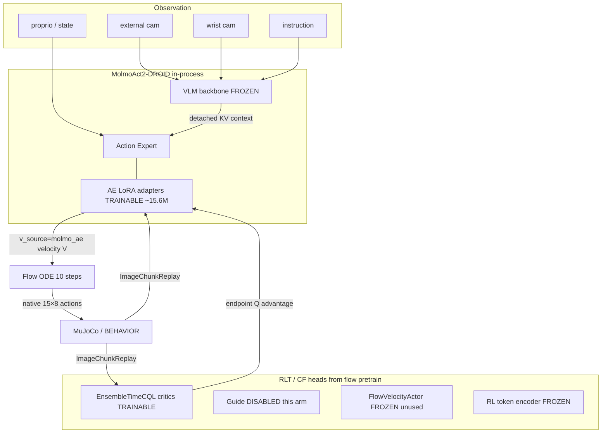
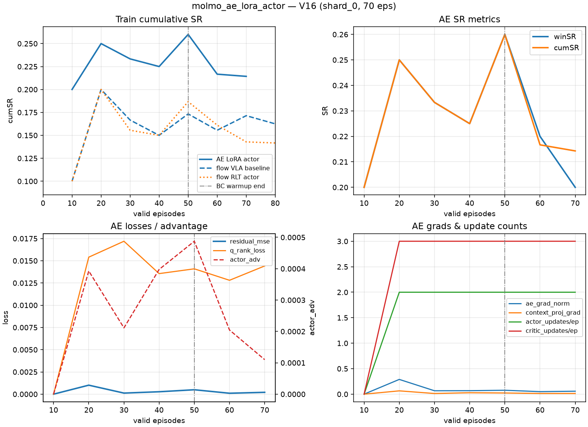

# `molmo_ae_lora_actor`

Provisional V16 arm: **online Consensus-Flow / RLT with MolmoAct2’s Action Expert (AE) as the trainable flow velocity `V`**, via AE-only LoRA. The VLM backbone stays frozen (knowledge insulation). Compared to `flow_rlt_actor`, this replaces the small RLT `FlowVelocityActor` with in-process Molmo AE adapters.

| Item | Value |
| --- | --- |
| Run dir | `runs/rlt_cf_v16_controlled/molmo_ae_lora_actor/` |
| GPU / packing | GPU 7, `AE_INSTANCES_PER_GPU=1` (no HTTP `serve.py`; `server_port=0`) |
| Checkpoint seed | `runs/rlt_pretrain_demo1k/rlt_cf_flow_pretrain_demo1k.pt` |
| Base VLA weights | HuggingFace `allenai/MolmoAct2-DROID` (bf16, in-process) |
| Code | `molmo_ae_backend.py`, `ae_flow_*` in `train_rlt.py`, CLI via `v16_harness.py` |

Snapshot below is from the live V16 long run (**shard_0**, ~70 valid episodes, refreshed 2026-08-14). Train SR ≠ held-out efficacy; gate still closed.

---

## Architecture



**Contract (logged at startup)**

| Field | Value |
| --- | --- |
| `action_dim` (robot) | 8 |
| `max_action_dim` (AE pad width) | 32 |
| `action_horizon` / `n_action_steps` | 15 |
| `n_obs_steps` | 1 |
| Norm | `q01_q99` / tag `franka_droid` |
| Deploy chunk | first `CHUNK_SIZE` steps × 8 dims (compact RLT view) |
| Flow steps | 10 |
| `v_source` | `molmo_ae` |

**Rollout paths**

- **Reference** (`predict_reference`): PEFT `disable_adapter()` → frozen base AE (MolmoAct behavior without LoRA).
- **Actor** (`predict`): trainable AE LoRA ODE; used for collect after BC warmup when `--always_collect_actor`.
- No CF guide (`--no_cf_guide`); explore σ = 0 (V16).

---

## Parameter count & freeze map

From V16 startup log:

```
MolmoAEBackend ready trainable=15,589,888 / total=5,457,786,096 (0.286%) lora=True
V14 AE-as-V enabled: trainable_ae=15589888 params, token frozen, v_source=molmo_ae
```

| Block | Params | Trainable? |
| --- | --- | --- |
| Full MolmoAct2 (`allenai/MolmoAct2-DROID`) | **~5.46B** | mostly no |
| AE LoRA only (`r=16`, `α=32`, dropout 0.05) | **~15.6M (0.286%)** | **yes** |
| VLM / vision-language backbone | (majority of 5.46B) | **frozen** |
| Base AE Linear weights (non-LoRA) | inside AE | **frozen** (adapters only) |
| RLT `FlowVelocityActor` | small MLP | **frozen** (unused; AE is `V`) |
| RL token encoder | — | **frozen** (`--freeze_token`, `tune_token_online=False`) |
| Ensemble critics (`n_critics=10`) | RLT heads | **yes** (`lr_critic=3e-4`) |
| Guide | — | **off** this arm |
| Soft dual `α` on residual | scalar | **yes** (`lr_alpha`) |

LoRA targets: every `action_expert` `nn.Linear` **except** `time_embed` / `action_embed` (kept native bf16). Scope is enforced so no VLM leaf (e.g. generic `out_proj`) can train. Required adapters include `context_k_proj` / `context_v_proj`.

Optimizer for AE: Adam at `--lr_ae` default **1e-4** (same as `lr_actor`). Grad clip 1.0 on LoRA params.

---

## Losses

### Actor (`ae_flow_actor_step`) — Molmo-native 15×{8→32} flow

On a batch from `ImageChunkReplay`:

1. Encode **detached** VLM KV (`encode_context`).
2. Sample \(t\sim U(0,1)\), interpolate source noise → BC target  
   \(a_{\mathrm{bc}} = w\,a_{\mathrm{ref}} + (1-w)\,a_{\mathrm{data}}\) (`bc_ref_coef=1` → pure reference by default).
3. Predict AE velocity \(v_\theta(x_t,t)\); **BC velocity MSE** vs \(a_{\mathrm{bc}}-x_0\).
4. One Euler step → local Q look-ahead; full ODE to endpoint → **endpoint advantage** vs reference Q.
5. **Soft-β residual**: endpoint vs reference MSE with `actor_beta=2.0` and learned `α` dual toward `target_divergence=0.0025`.

\[
\mathcal{L}_{\mathrm{actor}} =
-\lambda_{\mathrm{end}}\mathbb{E}[A_{\mathrm{end}}]
+ \mathcal{L}_{\mathrm{BC\text{-}vel}}
+ (\beta+\alpha)\,\mathrm{MSE}(x_1,a_{\mathrm{ref}})
\]

(`endpoint_aux_coef` default 0.5; β = 2.0 in V16.)

### Critic (`ae_flow_critic_td_step`)

Ensemble time-CQL TD on compact projected chunks, with rank / far-rank / shuffle-rank auxiliaries (`rank_coef=1`, etc.). AE is **eval** during critic steps (no LoRA grads).

### Not used on this arm

- Compact RLT `actor_step` / mixture collect  
- Guide distill (`ae_flow_guide_step`)  
- Token recon  

---

## Training phases (V16)

| Phase | Episodes | Collect policy | Updates |
| --- | --- | --- | --- |
| Success gate | until ≥ `ae_min_success_episodes=3` successes | reference / actor per schedule | **skipped** (`insufficient_success_episodes`) |
| BC warmup | `valid_episodes < actor_bc_episodes` (**50**) | **`reference`** (adapter-disabled AE) | AE LoRA + critics (after success gate) |
| Actor collect | ≥ 50 | **`actor`** (`--always_collect_actor`) | same; Q gates tag deploy only (do not block collect) |
| Deploy gate | anytime | — | still **closed** at 70 eps (`actor_lcb_below_threshold`) |

Curriculum helper (`v16_helpers.actor_phase_for_episode`): after 50 eps, `clipped_q` with `train_ref_dropout=0.5`. On the live AE shard the logged `actor_phase` field is often blank, but **collect flips reference→actor at 50** and β/advantage terms are active in `ae_flow_actor_step` throughout.

**Update budget (structural bottleneck)**  
Target `--updates_per_episode 32` / `--max_update_sec_per_episode 180`. Observed: **`time_budget` stop with ~2 actor + ~3 critic updates/ep** (microbatch 4, accumulation 4 → effective batch 16). MuJoCo wall dominates; AE forward is heavy.

---

## Data

### Offline (seed only)

- Flow RLT pretrain checkpoint: critics / model shell from `rlt_cf_flow_pretrain_demo1k.pt`.
- MolmoAct2 weights from HF snapshot (not re-downloaded each resume if cached).
- AE LoRA starts **fresh** on V16 reset (`FRESH` for this arm); no prior `molmo_ae_lora_latest.pt` unless resumed.

### Online env

- Benchmark: `runs/benchmarks/house0_kettle_v13/train`
- Task: *pick up the kettle* (house 0), pose cycle **24**
- Horizon 500, shard size 24, target **600k env steps / 1000 valid episodes**
- Snapshots: 0, 100, 200, 400, 700, 1000

### Replays

| Buffer | Path | Contents |
| --- | --- | --- |
| `ImageChunkReplay` | `ae_image_replay.npz` | external+wrist RGB, instruction, proprio, **full 15×8** ref/exec actions, rewards, success; capacity **2048**, `pos_frac=0.4` |
| Compact chunk replay | `chunk_replay.npz` | RLT-sized chunks for logging / non-AE paths |

At ~70 eps (shard_0): ~2048 AE transitions, ~15 success episodes in replay, ~643 MB image replay storage; success/failure row mix retained by pose-aware sampler.

Batches: `ae_batch_size=16`, `ae_microbatch_size=4` (grad accumulation).

---

## Hyperparameters (V16 defaults)

| Knob | Value |
| --- | --- |
| LoRA r / α / dropout | 16 / 32 / 0.05 |
| `actor_beta` | 2.0 |
| `train_ref_dropout` | 0.5 |
| `residual_clip` | 0.02 (safety) |
| `actor_bc_episodes` | 50 |
| Explore σ | 0.0 |
| `actor_mixture_prob` | 0.0 (retired) |
| Critic ensemble | 10 |
| AE updates / ep (cap) | 32 (wall-clock limited) |
| Critic / actor / AE lr | 3e-4 / 1e-4 / 1e-4 |

---

## Metrics & loss curves (live V16)



Also copied under the run:  
`runs/rlt_cf_v16_controlled/molmo_ae_lora_actor/plots/ae_metrics_overview.png`

### Latest point (shard_0, 70 eps)

| Metric | Value |
| --- | --- |
| cumSR / winSR | **0.214 / 0.200** (15/70) |
| env_steps | 30 313 / 600 000 (~5%) |
| `residual_mse` | ~2e-4 |
| `actor_adv` | ~1e-4 |
| `q_rank_loss` | ~0.014 |
| `ae_grad_norm` | ~0.06 |
| Gate deploy | **false** |
| Empirical actor vs ref | 20 actor eps @ 0.10 SR vs 50 ref @ 0.26 SR |

### Matched-@70 vs controls (train SR)

| Control | mean cumSR | Δ(AE − control) |
| --- | ---: | ---: |
| `flow_vla_baseline` (MolmoAct HTTP baseline) | 0.171 | **+0.043** |
| `flow_rlt_actor` (same flow offline pretrain, compact V) | 0.143 | **+0.071** |

Wide uncertainty (n=70, binomial SE≈0.05). AE is 1 shard and early; do not treat as held-out result.

### Per-log row sketch

| eps | collect | cumSR | residual_mse | actor_adv | act/crit updates | stop |
| ---: | --- | ---: | ---: | ---: | --- | --- |
| 10 | reference | 0.200 | — | — | 0/0 | insufficient_success_episodes |
| 20–50 | reference | 0.23–0.26 | ~1e-4–1e-3 | ~2–5e-4 | 2/3 | time_budget |
| 60–70 | actor | 0.21–0.22 | ~1–2e-4 | ~1–2e-4 | 2/3 | time_budget |

---

## Artifacts

| File | Role |
| --- | --- |
| `molmo_ae_lora_latest.pt` | LoRA / trainable AE state + meta (`env_steps`, contract) |
| `ae_image_replay.npz` | image replay resume |
| `rlt_online_latest.pt` (or shard ckpt) | critics / RLT shell |
| `metrics.jsonl` | schema v16 |
| Snapshots under `snapshot_ep{N}/` including `molmo_ae_lora.pt` | paired AE+RLT eval |

Eval requires the **paired** AE file (`eval_v16_controlled.sh` checks `molmo_ae_lora.pt`).

---

## How this differs from neighbors

| Arm | Action source | Online trainable policy | Guide |
| --- | --- | --- | --- |
| `flow_vla_baseline` | HTTP MolmoAct (`serve.py`) | none | no |
| `flow_rlt_actor` | RLT `FlowVelocityActor` on flow pretrain | compact V + critics | no |
| **`molmo_ae_lora_actor`** | **In-process Molmo AE + LoRA** | **AE LoRA + critics** | no |
| `flow_rlt_cf` | compact V + CF guide | V + G + critics | yes |

---

## Caveats

1. **Provisional / slow**: one shard, ~5% of target steps; update/ep ≪ 32 due to 180s CUDA+AE budget.
2. **Train SR only** until held-out `eval_v16_controlled.sh` finishes.
3. Gate never opened yet; empirical actor SR trails reference collect SR (expected while LoRA is early).
4. Requires `--cf_mode flow` and LoRA (`--no_ae_lora` rejected) so adapter-disabled reference stays well-defined.
